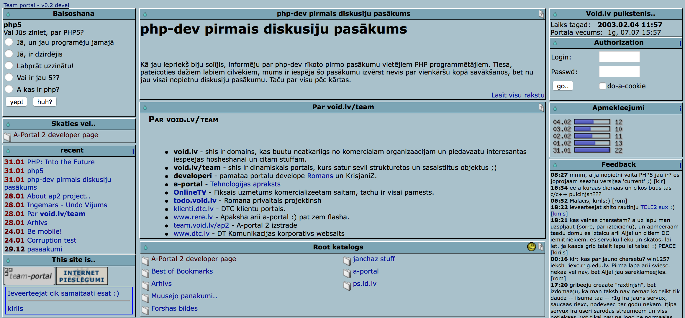
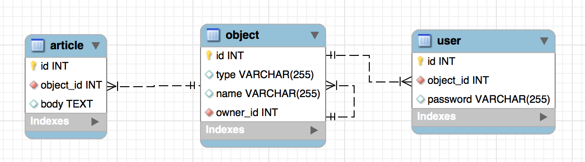
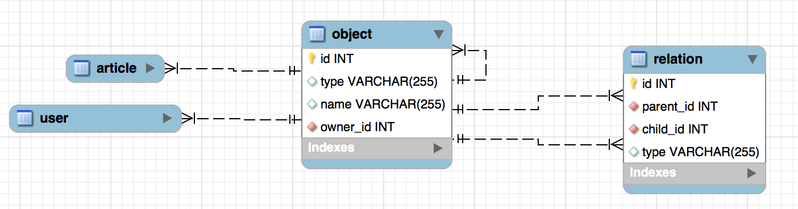
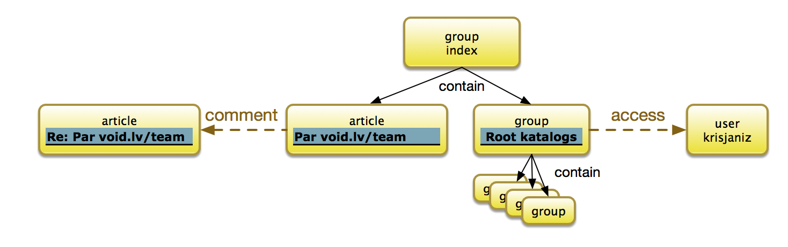

# Disjoint Subtypes in PHP

The pattern of disjoint subtypes have been helping me throughout my PHP career. I started using it back in 2003 [when I was building a web portal](http://web.archive.org/web/20030204095702/http://team.void.lv/) for our schools "computer club", however later I was using the approach in some of the commercial projects too. 

I'd like to tell you more about Disjoint Subtypes approach, what are the benefits of the approach and how it can be implemented and used efficiently in modern PHP.

## Team Portal (2003)

<style>

  img { width: 100% }

</style>



My goal with this project was to create a website where various users could authenticate, create objects from a pre-defined types then link them to the objects that other users have created. Above you could see the objects of the following types:

-   Article
-   Group
-   User

### 1. Database Schema and Object Inheritance

All of the objects, regardless of their type have been stored in the table "object". The table fields represented only the properties that are common for all the objects. For my example I have used (id, type, owner_id, name).

There were additional tables, that would be joined with `object` in order to supply additional fields. The "User" object require "password" field and "Article" object require "body" text field.

A simpler option is to cram all the fields into the "object" but this results in clutter and overhead, so instead the following structure is used:



It's important to note that only object with type="article" would have a corresponding record in "article" table.

### 2. Relations

Although traditional "relations" are used sometimes, for instance, each object has "user_id" that contains ID of the User object, unification of all the objects allows us to link any two objects with a "generic" relation.



This gives us very powerful ability to create new relationship between any two objects without altering the database structure:



(Note: Today a similar approach is used in Graph databases)

### 3. Unified Object Handling

Now that we have a unified way to store objects, the portal interface has also been created in a unified way. When ID is passed to a page, it will determine a type of the object and display it accordingly. The relationships are organised and checked based on types.

## Disjoint Subtypes Today (2017)

PHP has been different to what it was before, it's more powerful and our projects can rely on high quality 3rd party libraries, frameworks and extensions today. When I was building "Team Portal" I had to design and write all the queries directly in the code. Today we can deal this through "Persistence Abstraction" - a pattern that unifies and simplifies your work with the databases.

To put it simply - whenever I was writing code in 2003, I was thinking about "blue boxes". Today it's possible to think on the level of "yellow boxes".

My next implementation uses [Agile Data](https://github.io/atk4/data), so if you want to try out examples, you should install it:

``` bash
composer require atk4/data
```

Agile Data is an open-source general-purpose database abstraction framework for PHP. Its flexibility allow us to implement a "more complex" database patterns, such as Disjoint Subtypes and hide it as "implementation detail" from the rest of your application.

### 1. Define Object

The "Object" is the core element in our business logic and I'm going to represent it with a PHP class:

``` php
class Object extends \atk4\data\Model 
{
    public $table = '';
    function init() {
        parent::init();
      
        $this->addField('type');
        $this->addField('name');
        $this->hasOne('owner_id', new Object());
    }
}
```

Object can be extended and it's best if our PHP classes also follow inheritance. I'm defining "Article", "User" and "Group" next. The Model definitions use a standard Agile Data syntax (See: http://agile-data.readthedocs.io/en/develop/model.html and http://agile-data.readthedocs.io/en/develop/joins.html)

``` php
class Article extends Object
{
    protected $j_article;
  
    function init() {
        parent::init();
      
        $this->addCondition('type', 'article');
        $this->j_article = $this->join('article.object_id');
        $this->j_article->addField('body');
    }
}

class User extends Object
{
    protected $j_user;
  
    function init() {
        parent::init();
      
        $this->addCondition('type', 'user');
        $this->j_user = $this->join('user.object_id');
        $this->j_user->addField('password');
    }
}

class Group extends Object
{
    function init() {
        parent::init();
      
        $this->addCondition('type', 'group');
    }
}
```

### 2. Using Objects

Our goal with using Data Abstraction framework is to make sure the rest of your application can now work with "SubTypes" without any extra though.

Lets look at some use-cases and I'll provide reference code.

#### Authenticating User

When user logs in, we should load user record by username and verify the password:

``` php
$user = new User($db);
$user->loadBy('name', $username);
verify_password($password, $user['password']);
```

#### Adding new Article

If user wishes to create a new article:

``` php
$article = new Article($db);
$article->set($article_data_array);
$article['owner_id'] = $logged_in_user->id;
$article->save();
```

#### Automatically saving owner_id

Agile Data offers a persistence-level "Hook" that can be applied on all the models as they are associated with given persistence. Using that hook, we can pre-set 'owner_id' to that of a logged-in user:

``` php
$db->addHook('afterAdd', function($db, $obj) use ($logged_in_user) {
    if (!$obj instanceof Object) {
        return; 
    }
  
    $obj['owner_id'] = $logged_in_user->id;
});
```

#### Deleting All Object by a User

We can rely on MySQL constrain to get rid of all the related records, once the object is deleted, so the code to delete all objects belonging to a user:

``` php
$objects = new Object($db);
$object->addCondition('owner_id', $user_id);
$object->deleteAll();
```

### 3. Relations

So far we only created the objects but we didn't use the relations at all. Let's create basic relation object:

``` php
class Relation extends \atk4\data\Model {
    public $table = 'relation';
  
    public $parent_class = null;
    public $child_class = null;
  
    function init() {
        parent::init();
      
        $this->addField('type');
      
        $this->hasOne('parent_id', $parent_class ?: new Object());
        $this->hasOne('child_id', $child_class ?: new Object());
    }
}
```

I have set it up in such a way so that we could configure it for different types of associations in a run-time. You also have to add the following inside "init()" method of Object class:

``` php
$this->hasMany('parent_relation', [new Relation(), 'their_field'=>'child_id']);
$this->hasMany('child_relation', [new Relation(), 'their_field'=>'parent_id']);
```

Agile Data supports custom 'References', that makes it very handy for us. Next code is a modified version of 'Article' class to enable 'comments':

``` php
class Article extends Object
{
    protected $j_article;
  
    function init() {
        parent::init();
      
        $this->addCondition('type', 'article');
        $this->j_article = $this->join('article.object_id');
        $this->j_article->addField('body');
      
        $this->addReference('comments', function($m) {
            return $this
              ->ref('child_relation', ['child_class'=>new Article()])
              ->addCondition('type', 'comment')
              ->ref('child_id');
        });
    }
}
```

If you are new to Agile Data and it's patterns, this can seem too "magical", so I'll go over each line to explain:

Our first line defines a custom "Reference" which can be used with 'ref()' later:
``` php
$this->addReference('comments', function($m){
});
```

When 'ref()' is called, the callback will traverse 'child_relation, as defined in the Object, but will set oject property 'child_class' as specified. The return of this method call is 'Relation'.

``` php
ref('child_relation', ['child_class'=>new Article()]);
```

calling addCondition() will make sure that DataSet of Relations is limited only to records that satisfy the condition. The return of this method is still the same Relation object:

``` php
addCondition('type', 'comment');
```

Finally, without loading a specific relation, we traverse into child_id. This approach is called [Deep Traversal](http://agile-data.readthedocs.io/en/develop/references.html#deep-traversal) and is one of Agile Data usage patterns. The return of this model will be 'Article' object with an extra condition that looks like `"where id in (select child_id from relation where type='comment' and parent_id=123)"`:


``` php
ref('child_id');
```

The result of this code is that we can now use easily query all Comments on any article like this:

``` php
$comments = $article->ref('comments');
// can now do something with comments, such as count them:
echo $comments->action('count')->getOne();
```

This syntax is perrfectly compatible with other references that Agile Data defines (http://agile-data.readthedocs.io/en/develop/references.html). In reality the `$comments` object of class 'Article' will be automatically conditioned to be related with `$article` through a Relation with type='type'.

In a similar fashon lets define Group's connections:

``` php
$this->addReference('contents', function($m) {
    return $this
      ->ref('child_relation', ['child_class'=>new Object()])
      ->addCondition('type', 'contain')
      ->ref('child_id');
});
```

### 4. Using Objects and Relations

Finally, I'll go over several use-cases. (please note that in the use-cases code is kept short and DI is rarely used).

#### Root Folder Contents

To display the contents of our Root folder, we need to load the 'Group' with a specific name first, then traverse to get a Model that maps into folder contents:

``` php
$root = new Group($db);
$root->loadBy('name', 'Root katalogs'); // not ideal, but for simplicity

$contents = $root->ref('contents');

$data = $contents->export(['id','name','type']);
```

#### Link Article as Reply

If user posts a Comment on an article, we should create it as an "Article" first, then create relation with the parent. Modify your "Article" class to add this method:

``` php
function addExistingComment(Article $comment) {
  
    if (!$comment->loaded()) {
        throw new Exception('Can only add existing articles');
    }
  
    $rel = new Relation($this->persistence);
    $rel->insert([
      'type'=>'comment'
      'parent_id'=>$this->id,
      'child_id'=>$comment->id
    ]);
}
```

#### New Comment (improved version)

Agile Data has various ways to automate and abstract logic, so here is another implementation, which is more suitable for adding new comments. The philosophy in Agile Data advise to leave database opeartion to the latest moment possible, so I'll be transparently adding "Hook" to the Article model which will link it to the parent after it's saved.

``` php
function newComment() {
    $a = new Article($this->persistence);

    $a->addHook('afterInsert', function($m) {
        $rel = new Relation($m->persistence);
        $rel->insert([
          'type'=>'comment'
          'parent_id'=>$this->id,
          'child_id'=>$comment->id
        ]);
    });  
  
    return $a;
}
```

This code can now be used more conveniently:

``` php
$article = new Article($db);

$article->load(123);

$comment = $article->newComment();

$comment->import([
  ['name'=>'comment1', 'body'=>'article is great'],
  ['name'=>'comment2', 'body'=>'i mean it!']
]);
```

#### UI Integration

The $comment model is also very suitable to pass into the UI layer and link with the presentation logic. If you are using [https://github.com/atk4/ui](Agile UI) or [https://agiletoolkit.org/](Agile Toolkit) then your code to display:

``` php
$article = new Article($db);

$article->load(123);

// $layout should be an existing View

// display previous comments in template of $layout
$comment_list = $layout->add('Lister', ['spot'=>'Comments']);
$comment_list->setModel($article->ref('comments'));

// display a form for posting new comment
$form = $layout->add('Form', ['spot'=>'NewComment']);
$form->setModel($article->newComment());
$form->onSubmit(function($form) {
  
    // on submission, create new Comment article, link it and refresh
    // list of comments.
    $form->save();
    return [
      $form->js()->reset(),
      $previous_comments->js()->reload()
    ];
});
```

