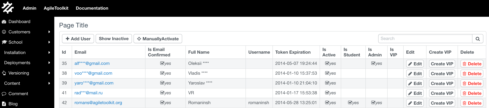

# How to fight Spaghetti code with Open-source

Few months ago my oldest web application was replaced after it was in daily use for 15 years. This being an extreme case - most web apps developed today needs to be refactored or replaced at some point in time. Why is it that some applications have longer lifetime than the others.

In this blog post I would like to look primary reasons that reduce lifetime of web applications and how to fight them.

## Definition of code clutter

When we (developers) write commercial code we have to consider all sorts of constraints. Our management want us to meet the deadlines and show consistent progress. Certain features that are developed and stable are considered "hands-off" to avoid introduction of the bugs. Here is my list of things that contribute to code clutter:

 - unclear requirements
 - significant change requests
 - limited developer budget
 - over-enginered solution
 - lack of code consistency
 
It's surprising that many software teams today are adopting Agile Software Development methodology which has some of the principles that can significantly contribute to clutter:

 - focus on short-term features, encourage user feedback
 - make user participate and embrace the change requests
 - focus on short release cycles
 - get product to market faster
 
As a result the produced code requires a much higher developer skills and will require significant refactoring to be done even at the early stages of software development. 

## Top-down vs Bottom-up design

When developing an application from scratch there are two ways to approach the architecture of the application. The traditional approach is a bottom-up design, where the low-level components are designed and developed first and then re-used to develop a high-level components.

To give you an example of the bottom-up design - imagine that you create extensive test-suite for your "billing engine", then create a API to implement all the requirements and then following with the User Interface that's tied to your functionality.

Unfortunately Agile Software Development puts a lot of focus on the UI as that's something that can be shown to the "User" for early feedback. A top-down design is more suitable for using Agile methodology. To put all of this in the context of an early start-up, the following ends up happening:

1. Star-up raises early seed funding for creating Web App.
2. Pressured by limited budget, a quick minimum viable product is required.
3. Team decides to go with Wordpress or Drupal and re-use existing "add-ons" to achieve functionality quick
4. Initial product gets a new look and is launched
5. First clients start to sign up
6. Company seeks further investment

At this point - if company is successful with the fundraiser, they have a choice of either replacing system entirely or try to somehow patch-it-up. With the pressure from investors the second option is always the answer and that results in gradual increase of code clutter and product support cost skyrockets.

## What should you do instead

If you are a start-up that has been caught in "bug-fixing" cycle - do not panic. I have dedicated 15 years of my carrier at finding the good option.

Agile Toolkit is my open-source collection of frameworks that is designed to improve code efficiency throughout your application, reduce code clutter and divert your limited budget towards adding those desired features. I have set out to provide a solution under the following conditions:

 - your existing team can do most of the work. You don't need to hire new staff or pay consultants.
 - your existing application remains functional and the transition is gradual
 - using Agile Toolkit costs you nothing as it is open-source and licensed under MIT
 - your team remain in full control over the code and priorities

There are three major components to Agile Toolkit: Agile Data, Agile UI and the Platform.

### 1. Gradually clean up your business logic

A clear implementation of the business code inside your application is crucial for integrity and stability of your application. Your first target needs to be the business logic.

 - your database schema remains the same
 - you do not touch existing (working) business code
 - your new "logic" should be accessible from your existing code
 
As you follow through the clean-up process, you will be able to achieve the following goals:

 - clean up clutter in your code by organising it better
 - make your logic shorter and more readable
 - use your database more efficiently
 - improve stability through test-scripts
 - decouple your code from specific database (e.g. MySQL)
 - reduce number of database queries per page
 
#### 1.1. Data Model

While it's highly dependent on your current technology, most of the PHP frameworks and applications will allow you to use "Composer" dependency manager. Add "atk4/data" as your required package and define a new namespace for your new code. Start defining your business entities following my guidelines. for each entity (e.g. User, Order, Payment, Invoice) you'll have to define properties, persistence, calculations, relations, types and inheritance. For the average application this process takes about 1 day of work. When complete, the Agile Data Objects can be used to access and manipulate your current data.

#### 1.2. Business Logic

You follow by creating a more complex "business operations" such as order processing, item consolidation, payment processing, data import, integration with external services, etc. This step will take you longer time, but your team can do focus on one function at a time and always close up functionality with test-scripts while keeping your new code clean and tidy. 

#### 1.3. Integration

Once you have defined your new data model it's time to integrate it into your existing application. Since you haven't changed your database, this will be a very straightforward step. Let's assume you had code like this on your page:

``` php
$data = $_POST;
$data = somehow_sanitize($data);
$order = $db->query("select ... ");
if (!$check_requirements) {
    // interact with user
}

// lots of lines working on the $order data and preparing operation

// now time to update database
$db->beginTransaction()
$db->query("insert ...");
$db->query("update ...");
$db->commit();

// finally show user the result
```

After you replace it with the method from Agile Data, it will look like this:

``` php
$order = new newlogic\Model_Order($db);
$order->load($_POST['order_id']);

try {
  $order->confirmOrder($_POST['amount'], ..);
} catch (LogicException $e) {
   // interact with user
}

// finally show user the result
```

### 2. User Interface - building back-end

Agile UI is an open-source framework inside Agile Toolkit that is designed to give you out-of-the-box user interface that is directly integrated with your newly created Data Model. It's ideal for creating your new back-end admin system for your application as it virtually takes no time to create.

``` php
$cr = $this->add('CRUD');
$cr->setModel('newlogic/Order');
$cr->addAction('confirmOrder', 'column');
```

This code would create a fully-functional admin page similar to this:



Agile UI will provide you a way to execute your business logic operations but you will also able to design a custom UI from the wide selection of existing components and widgets.

 - You can link new Admin UI with your old one
 - Your staff can gradually transition
 - Adding new features to the new admin will be much faster


### 3. User Interface - Public front-end

At this point you can make a choice. You can either stay with your existing frontend-ui or replace it with a more consistent, flexible and responsive Agile UI. Creating a new design for your web app will obviously affect your users, but that usually has a very positive feedback.

Your strategy for the front-end update should be the launch of the separate 'BETA' site that can offer the same functionality as your existing site but would look better, be more responsive, more flexible and more consistent.

To help you with the front-end development you can make use of Agile Platform that contains wide variety of widgets, themes and add-ons that can significantly speed up your development pace. All of the add-ons on our platform are offered with a very good "support" program specifically designed for companies like yours, are fully tested, will integrate with your existing business logic seamlessly and will automatically adopt into look and feel of your application.

Once your new front-end is complete and deployed, you will be officially free form the troubles of your old code.

## Keeping your code efficient

Our framework design is specifically aimed at keeping the code clutter from ever re-appearing in your application. We focus on making further expansion of your application as simple as possible:

 - Adding new core entities and new business operations (features)
 - Modifying or Refactoring your User Interface
 - Partially transitioning to NoSQL to handle big data
 - Further improving database performance, adding caching
 - Expanding your REST API or building new interfaces
 - Keeping your code fully tested, fully profiled and very lightweight
 - Integrating 3rd party APIs correctly
 - Adding your own extensions or widgets or ordering 3rd parties to build them for you
 - Universal integration with JavaScript components
 - Training new employees to handle your code
 - Using 3rd party services (such as PDF generation)
 
## Empowering developers and companies with open-source
 
My team offers Agile Toolkit under MIT License, at no cost and instead focuses on commercial eco-system around our open-source products.

We believe in the power of Open-Source and we commit to offer high quality products for developers at no cost as well as creating more opportunities for a regular developers across the world to connect with companies and offer high-quality services. 


