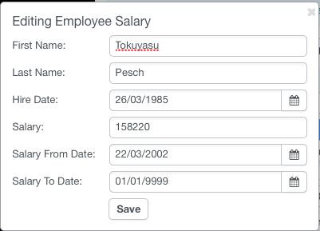

# Real-life Database example for Agile Toolkit

Agile Toolkit is a PHP web framework with a particularly powerful ORM (Object-relational mapping) engine. This ORM goes much further beyond translating your data records into objects. It is fluent with joins, expressions, conditions and subqueries helping developer to take full potential of SQL engine through object-oriented interface.

To help illustrating some of these features, I have created a new enhancement to the [Agile Toolkit Kitchen Sink project](http://sink.agiletoolkit.org/). The best part, you can download this project and explore it on your laptop, [it's available on GitHub](https://github.com/atk4/sink).

For data I decided to use a [standard test_db repository](https://github.com/datacharmer/test_db), that creates about 300,000 employee records in the database along with 2,8 millions of salary records. The data is relational and can be seen in the following ER Diagram:

{.atk-expand}

Within just 3 hours of coding, I've managed to build an interface where a user can find answers to various questions such as:

 - What is a current salary of a specific employee
 - What was employee salary for a specific date in time
 - What was average employee salary at the time of hiring
 - Who was hired with a largest salary
 - How many employees were working during 1 jan of 1995
 - And many other questions.

The interface for pulling all this data is really simple:

{.atk-expand}

And a LIVE DEMO is also available: [http://sink.agiletoolkit.org/employees/browse](http://sink.agiletoolkit.org/employees/browse)

## Defining the Models

Unlike most other projects where "id" column is defined as auto-increment, the test_db does not rely on "id" columns at all, instead they use emp_no and dept_no througout all of the database.

Since those are the only reasonable databases to work with directly, I have started by defining their respective model classes: [Model_Department](https://github.com/atk4/sink/pull/1/files#diff-9641f6e55c7e782cdbe38e414bf51443R1) and [Model_Employee](https://github.com/atk4/sink/pull/1/files#diff-82d9cbdf3be058742e05be41eecd2900R1).

Once those were complete, I created a simple page structure with "CRUD" to display the raw data: [page/emplayees/browse.php](https://github.com/atk4/sink/pull/1/files#diff-7929a2f9a2e05727246a135c83bd9f13R1) along with some pagination and quick-search. Nothing complex is done so far, this is pretty straightforward ATK workflow.

### Dealing with Salaries

Salaries in test_db are defined for date periods. Each record in "salaries" table contains from_date and to_date. So hypothetically to get a salary for a specific employee at a given date in time you would need to run:

``` sql
SELECT * FROM salaries
    WHERE emp_no = "10014"
      AND from_date<='1999-01-01'
      AND to_date>='1999-01-01';
```

While it should be pretty trivial to create a model for salaries, I wanted to create it in a context of existing Model_Employee, so I extended that class by creating [Model_Employee_Salary](https://github.com/atk4/sink/pull/1/files#diff-e22b4215d46b512e00450a5f61fde608R1).

This Model class has a property "date" that can be set during initialization like this:

``` php
$emp = $this->add('emp/Model_Employee_Salary', ['date'=>'1999-01-01']);
$emp->load('10014');
var_dump($emp->get());
```

As you can see - I can now load the employee by ID and it will fetch his salary for that specific time: `["salary"]=> string(5) "53962"`

Instead of querying "salaries" table directly, it is joined to the main table and conditioned. This is like adding "current salary" to your employee table, without actually changing anything and retaining the ability to look at historical values.

### Building the User Interface

I wanted to create an interface to better demonstrate the workings of the ORM, so I added a 3-column box on top of the standard grid, ([See page/employee/browse.php](https://github.com/atk4/sink/pull/1/files#diff-7929a2f9a2e05727246a135c83bd9f13R54)).

The form, which I added in the middle column can refresh the page through AJAX / reload() action and pass "date" parameter if user want to see salaries from a specific date.

### Beauty of persistent conditions

Because of the way how conditions and join work with the models, a standard UI elements such as QuickSearch or even field ordering can be applied on top of the model we have configured to this point. It takes a great effort in most of the projects to anticipate all the possible modifications in your query and Agile ORM allows us to simply specify one model for binding with the CRUD without worrying that re-ordering elements or quick-search may break something.

Surprisingly not only you can browse the records, but you can edit them. You can change either name of employee or their salary and an appropriate record will be modified. The UPDATE query will not use "JOIN" but will be smart enough to understand which record needs to be edited. Finally if any of your modifications will cause model to fall outside of defined conditions, your operation will not be performed.



Agile ORM and the View objects of Agile Toolkit reassures you that all the operations it's going to perform will properly respect any conditions that you place upon it. In a business application this restriction can often avoid nasty bugs and problems and the way Agile ORM implements work with SQL - everything still fits a single query.

### AJAX, Reloading and Sticky GET Arguments

Probably no that obvious, but any Agile Toolkit application some features of those desktop applications especially when it comes to refreshing part of your UI.

The form handler will refresh the contents of the tab, but not the whole page. Similarly clicking on buttons (Get Average Salary) will perform AJAX request while sill maintaining the date condition you have defined.

https://github.com/atk4/sink/pull/1/files#diff-7929a2f9a2e05727246a135c83bd9f13R93

### Expression in Condition

Quite un-obvious but very powerful feature is the use of expressions in condition. As per my design the model retrieves data from the database with salaries fixed to a specific date. Expressions allow me to associate this date with another field or a more complex function.

https://github.com/atk4/sink/pull/1/files#diff-7929a2f9a2e05727246a135c83bd9f13R37

In this case I am using employee's hire_date and am able to pull salary records from various periods. Agile ORM automatically converts field object returned by `getElement('hire_date')` into a valid expression.

### Security

As a final note I must say that while my app uses a rather simple UI logic, it's protected against JavaScript and SQL injections and I don't even have to do anything about it.


## Further Posts about Agile ORM


I would like to add more interesting examples and use-cases for Agile ORM. Please share what you would like me to blog on next.


### Comments

<div id="disqus_thread"></div>
<script>
(function() {
var d = document, s = d.createElement('script');

s.src = '//nearlyguru.disqus.com/embed.js';

s.setAttribute('data-timestamp', +new Date());
(d.head || d.body).appendChild(s);
})();
</script>
