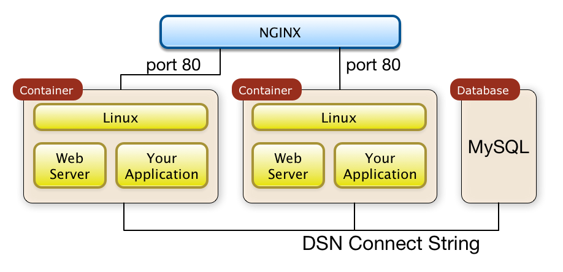

## Replacing your old Webserver with Dokku-alt — The open-source Heroku Alternative

During the last few years I have migrated all my web applications from a classic LAMP server setup into Ubuntu running [Dokku-alt PaaS manager](http://dokku-alt.github.io). Despite some strong benefits there are very few articles/tutorials on how to configure and get your web apps running. This week I am writing about fundamental differences, benefits and challenges as you try out to build your own PaaS.

### A brief history on Heroku, Dokku vs Dokku-alt

Platform as a Service solutions (such as Heroku, EngineYard, AppFog etc) simplify server management by replacing conventional Web Hosting platforms with a more controlled deploy-based  infrastructure.

Dokku was created as an open-source alternative for those commercial solutions that anyone can run on a basic Linux server.

Dokku was built as a basic script (in BASH) implementing a very basic functionality comparable to commercial solution along with a command-line interface `dokku` to manage and configure your apps on the server. Dokku relies on an extensive plugins structure to add additional commands, functionality and implement several action-hooks thus introducing features such as Database Serice, Caches, SSL support and more.

Dokku-alt was created as a fork that merges some of the essential plugins directly into core distribution giving a product that can be used out-of-the-box without additional search, installation and potentially "fixing" some of the 3rd party plugins.

The initial plan was to keep "dokku-alt" compatible with "dokku", but projects have diverged and became incompatible while maintaining some architectual and command-line usage similarities.

I have found a better success with dokku-alt. Despite it's slow/stalled development pace it was always offering a reliable and good set of functionality. In this article I'll be using dokku-alt, however the original "dokku" could have been used for the same tasks with sufficient set of plugins.

### How is Dokku-alt different to your regular webserver?

If you have never used application platforms before you need to be aware of some key differences to the conventional hosting platforms:

**1. Deployment and Containers**

{.atk-expand}


The time when you used to ftp "into your webserver" to upload a changed file is long over. We all know how many error and problems this approach was creating with random errors popping up on live sites, loosing important changes etc.

With Dokku-alt you no longer change files on your server, instead of you "deploy" your application into a "container" a disposable, read-only virtual machine. When you need to deploy a change to your server, your entire container is replaced with a new one, built from scratch.

**2. Forward Proxying**

{.atk-expand}

Previously you had to enable support for all the programming languages you were planning to use on your server. With dokku-alt your webserver is a simple reverse proxy (implemented by Nginx). Different containers can run different language interpreters and even different operating systems an as long as they expose port 80 it will be attached to a URL on your webserver. With isolation and separation you can now run as many different PHP versions as your apps require without any conflicts.

Dokku-alt acts as a back-office system creating and recycling containers and seamlessly updating Nginx config. It also keeps certain configuration about each application (container).

**3. Access Control**

The deployment is performed through a `git push` mechanics. If you are already using *Github* in your project, you must have configured SSH keys to authenticate access to your repositories. The same key authentication is used by Dokku-alt:

<pre class="command-line" data-prompt="$"><code class="language-bash">
git remote add deploy dokku@my.dokku-alt.com:my-app
git remote deploy master</code></pre>

You will need to authorize your personal SSH key to deploy `my-app` to `my.dokku-alt.com` server. Log into your Ubuntu box and run:

<pre class="command-line" data-user="root" data-host="dokku-server"><code class="language-bash">
dokku deploy:allow my-app</code></pre>

then copy-paste your public SSH key followed by *CTRL+D*. Re-try deploy command if it failed previously:

<pre class="command-line" data-prompt="$"><code class="language-bash">
git remote deploy master</code></pre>

Once deployed, your application will most likely appear under a URL `http://my-app.my.dokku-alt.com`, but you can use `dokku` command to configure a different domain name for your application.

Deploy keys only allow user to `git push` one specific app, but they won't be able to change application configuration. You can define multiple keys or use one key to deploy multiple apps. There are also Admin level access which will give you access to all apps and also `dokku` command:

<pre class="command-line" data-prompt="$"><code class="language-bash">
ssh dokku@my.dokku-alt.com rebuild my-app</code></pre>


**4. Services, Dependencises and CRON jobs**

Policy of running ALL of your software inside containers requires you to adjust your common practices. You will have to place your cron jobs, daemons and other dependencies inside containers. This may be a challenging task at first, but eventually you will start to enjoy the cleanleness and stability of your infrastructure.

Once you describe the services you need you can easily deploy your app to a new location. If your apps needs scaling, you may even look into DEIS that focuses on multi-server deployment on top of CoreOS architecture while still using same deployment mechanics as dokku-alt.

The other important change is that your Database now needs to be defined as a "Service". It may be offered by 3rd party such as Amazon RDS, Clusterpoint or MongoLab and defined inside your application through a "DSN / Connection String".

{.atk-expand}

**5. External Volumes**

While you can still `enter` your containers and change files, you will need to avoid doing this, as all your changes inside container will be wiped with next deploy. You can create a persistent *volume* inside your container if your application need to store data or even link multiple applications through the same volume. I have been using that for application log file monitoring initially but then switched to using 3rd party log analytics services.

**Conclusion and 12-factor Apps**

[www.12factor.net](http://12factor.net) contains a list of 12 principles a modern application should follow. The principles are aimed at improving your application structure and it's ability to scale. When following those principles you will be able to deploy your application to your own dokku-alt architecture with ease.

### Buildstep vs Dockerfile

After you have pushed your repository into dokku-alt server, it will execute a chain of commands that will build and deploy your application:

 1. Repository is clonned into a temporary folder
 2. Submodules are installed
 3. New image is built either using "Buildstep" or "Dockerfile"
 4. Container with new image is launched
 5. NGINX updates routing towards new container
 6. Old container is retired

(If you would like to see this process inside dokku-alt plugin, open `var/lib/dokku-alt/plugins/dokku-rebuild/commands` file and find function `dokku_build_app_from_git()`)

Step 3 can be executed in two possible ways based on the presence of "Dockerfile" inside your repository.

**Without Dockerfile - Buildstep**

Dokku, Dokku-alt, Heroku and other PaaS systems will start by looking inside your repository in attempt to find "Dockerfile". If that file is not present, they will attempt to *detect* the language of your app. Existing `index.php` in the root folder of your repository will assume that your application is written in PHP. If server will find `package.json` file instead, it will assume that you are deploying [NodeJS application](https://github.com/heroku/node-js-sample).

Detection is done by cylcing through list of supported "Buildpacks" trying to find definite signs of certain language or framework. PHP buildpack contains [detection script](https://github.com/heroku/heroku-buildpack-php/blob/master/bin/detect) that will look for `index.php` and `composer.json` files. If buildpack has recognized the environment it will then be used to create an *environment* inside your container for your application.

Buildpacks rely on their own internal rules as they try to read settings such as desired version of PHP, location of *webroot* or other webserver settings. Buildpack makes it convenient to create apps quickly, but they lack in flexibility and I have found them to be quite slow despite some of the caching they perform.

**With Dockerfile**

[Dockerfile](https://docs.docker.com/engine/reference/builder/) is a file inside your repository containing the steps that Docker will perform during creation of your container environment. This file is very simple and if you know about Linux and configuration file, you will find that Dockerfile is much more intuitive for you. Docker takes advantage of simple nature of Dockerfile by creating intermediate container after each line. When deploying your app again, the un-changed part of your Dockerfile will not be rebuilt and cached container will be used instead. This mecanics speeds up your deployment speed significantly.

If you wonder how Dockerfile looks like, here is a short example:

``` docker
FROM ubuntu:latest
MAINTAINER Romans <me@nearly.guru>
RUN apt-get update
RUN apt-get -y upgrade
RUN DEBIAN_FRONTEND=noninteractive apt-get -y install \
        mysql-client apache2 libapache2-mod-php5

RUN a2enmod rewrite
RUN a2enmod headers

# setting up your app
RUN mkdir -p /app && rm -fr /var/www/html && ln -s /app /var/www/html

ADD vhost.conf /etc/apache2/sites-enabled/000-default.conf
ADD run.sh /run.sh
ADD . /app

# Configure container settings
EXPOSE 80
WORKDIR /app
CMD ["/run.sh"]
```

I have simplified this file but you can look at the fully working version that will [install Wordpress inside your container](https://github.com/romaninsh/docker-wordpress/blob/master/Dockerfile).

The first few lines will upgrade version of "ubuntu" inside your container. This may take a while during your first deploy, but Docker caching will speed it up next time.

Second block of lines places your repository contents inside `/app`. It will also upload a simplified [vhost.conf](https://github.com/romaninsh/docker-wordpress/blob/master/vhost.conf) for your apache configuration. This file will also contain location of WEBROOT or any other web-server settings.

Final piece will instruct Docker that port 80 needs to be exposed through NGINX proxy and that the file [run.sh](https://github.com/romaninsh/docker-wordpress/blob/master/run.sh) must be runing during a lifespan of this container. I normally include few more shell scripts inside my Dockerfile, that perform post-build changes. Few important notes:

 - Dockerfile is executed during "build" step.
 - `run.sh` is executed after your new container is lauched.

If your server is rebooted, your containers will not be re-built but `run.sh` will be executed once again (in case you want to rename some files). `run.sh` can also rely on environment variables which are not available during build phase.

## Further practical advice on Dokku-alt

In my work I'm mostly deploying PHP applications written in [Agile Toolkit](http://agiletoolkit.org/) through one or several *dokku-alt* containers. My single application repository always contains multiple "interfaces" - frontend, backend and quite often will also have an "api" end-point.

I heavily rely on CONFIG variables and perform container tweaks after it has been built to manipulate Webroot and some other settings. In some instances I create a shared volumes between containers.

If you would like me to write another, a more detailed blog post about practical use of Dokku-alt and look at some practical cases - please [let me know on twitter - @romaninsh](https://twitter.com/romaninsh).
